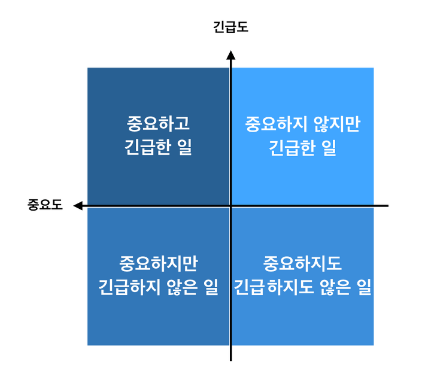

# 1부 - 소개

1부– 소개

- 프로그램을 동작하게 만들기는 그리 어려운 일이 아니다.
- 하지만 프로그램을 제대로 만드는 일은 전혀 다르다.  
소프트웨어를 올바르게 만드는 일은 어렵다.  
적정 수준의 지식과 기술을 겸비하고 사고력과 통찰력을 갖춰야 하며 어느 정도의 훈련과 헌신이 필요하다.  
소프트웨어를 올바르게 만들려면 무엇보다도 기술을 향한 열정과 전문가가 되려는 열망이 필수다.
- 제대로 된 소프트웨어를 만들면 아주 적은 인력만으로도 새로운 기능을 추가하거나 유지보수할 수 있다.  
변경은 단순해지고 빠르게 반영할 수 있다.  
결함은 적어지고 잦아든다.  
최소한의 노력으로 기능과 유연성을 최대화할 수 있다.

# <1장 – 설계와 아키텍처란?>

- 설계(design)와 아키텍처(architecture)
- ‘아키텍처’는 저수준의 세부사항과는 분리된 고수준의 무언가를 가리킬 때 흔히 사용하는 반면, ‘설계’는 저수준의 구조 또는 결정사항 등을 의미할 때가 많다.
- 저수준의 세부사항과 고수준의 구조는 모두 소프트웨어 전체 설계의 구성요소다.  
이 둘은 단절 없이 이어진 작물과 같으며, 이를 통해 대상 시스템의 구조를 정의한다.  
개별로는 존재할 수 없고, 실제로 이 둘을 구분 짓는 경계는 뚜렷하지 않다.  
고수준에서 저수준으로 향하는 의사결정의 연속성만이 있을 뿐이다.

## 목표는?

- 소프트웨어 아키텍처의 목표는 필요한 시스템을 만들고 유지보수하는 데 투입되는 인력을 최소화하는 데 있다.
- 설계 품질을 재는 척도는 고객의 요구를 만족시키는 데 드는 비용을 재는 척도와 다름없다.  
이 비용이 낮을 뿐만 아니라 시스템의 수명이 다할 때까지 낮게 유지할 수 있다면 좋은 설계라고 말할 수 있다.
새로운 기능을 출시할 때마다 비용이 증가한다면 나쁜 설계다.

## 무엇이 잘못되었나?

- 이솝의 “토끼와 거북이 우화”  
지나친 과신이 가진 어리석음을 말해준다.
- 현대의 개발자도 이와 비슷한 경주를 하며, 토끼와 유사한 과신을 드러낸다.  
현대의 대다수 개발자는 뼈 빠지게 일한다.  
하지만 그들의 뇌는 잠에 취해 있다.  
훌륭하고 깔끔하게 잘 설계된 코드가 중요하다는 사실을 알고 있는 바로 그 뇌가 잠자고 있다.
- 이들 개발자는 “코드는 나중에 정리하면 돼. 당장은 시장에 출시하는 게 먼저야!”라는 흔해 빠진 거짓말에 속는다.
- 테스트 주도 개발(TDD)
- 소프트웨어 개발의 단순한 진리 : “빨리 가는 유일한 방법은 제대로 가는 것이다.”
- 자신을 과신한다면 재설계하더라도 원래의 프로젝트와 똑같이 엉망으로 내몰린다.

## 결론

- 어떤 경우라도 개발 조직이 할 수 있는 최고의 선택지는 조직에 스며든 과신을 인지하여 방지하고, 소프트웨어 아키텍처의 품질을 심각하게 고민하기 시작하는 것이다.
- 소프트웨어 아키텍처를 심각하게 고려할 수 있으려면 좋은 소프트웨어 아키텍처가 무엇인지 이해해야 한다.
비용은 최소화하고 생산성은 최대화할 수 있는 설계와 아키텍처를 가진 시스템을 만들려면, 이러한 결과로 이끌어 줄 시스템 아키텍처가 지닌 속성을 알고 있어야 한다.

# <2장 – 두 가지 가치에 대한 이야기>

- 행위(behavior)와 구조(structure)
- 행위
    - 소프트웨어의 첫 번째 가지는 바로 행위(behavior)다.
    - 프로그래머는 이해관계자가 기능 명세서나 요구사항 문서를 구체화할 수 있도록 돕는다.
    - 그리고 이해관계자의 기계가 이러한 요구사항을 만족하도록 코드를 작성한다.
- 아키텍처
    - 소프트웨어의 두 번째 가치는 ‘소프트웨어(software)’라는 단어와 관련이 있다.
    - 소프트웨어를 만든 이유는 기계의 행위를 쉽게 변경할 수 있도록 하기 위해서다.
    - 소프트웨어가 가진 본연의 목적을 추구하려면 소프트웨어는 반드시 ‘부드러워’야 한다.
    - 다시 말해 변경하기 쉬워야 한다.
    - 변경사항을 적용하는 데 드는 어려움은 변경되는 범위(scope)에 비례해야하며, 변경사항의 형태(shape)와는 관련이 없어야 한다.
    - 아키텍처가 특정 형태를 다른 형태보다 선호하면 할수록, 새로운 기능을 이 구조에 맞추는 게 더 힘들어진다.
    - 따라서 아키텍처는 형태에 독립적이어야 하고, 그럴수록 더 실용적이다.

## 아이젠하워 매트릭스

- 소프트웨어의 첫 번째 가치인 행위는 긴급하지만 매번 높은 중요도를 가지는 것은 아니다.
- 소프트웨어의 두 번째 가치인 아키텍처는 중요하지만 즉각적인 긴급성을 필요로 하는 경우는 절대 없다.
- 위 네 가지 경우에 우선순위를 매기면
    - 1 긴급하고 중요한
    - 2 긴급하지는 않지만 중요한
    - 3 긴급하지만 중요하지 않은
    - 4 긴급하지도 중요하지도 않은
- 아키텍처, 즉 중요한 일은 이 항목의 가장 높은 두 순위를 차지하는 반면, 행위는 첫 번째와 세 번째에 위치한다
- 업무 관리자는 보통 아키텍처의 중요성을 평가할 만한 능력을 겸비하지 못하기 때문에 개발자는 딜레마에 빠진다.
- 소프트웨어 개발자를 고용하는 이유는 바로 이 딜레마를 해결하기 위해서다.
- 따라서 기능의 긴급성이 아닌 아키텍처의 중요성을 설득하는 일은 소프트웨어 개발팀이 마땅히 책임져야 한다.
- 아키텍처를 위해 투쟁하라
    - 아키텍처가 후순위가 되면 시스템을 개발하는 비용이 더 많이 들고, 일부 또는 전체 시스템에 변경을 가하는 일이 현실적으로 불가능해진다.
    - 이러한 상황이 발생하도록 용납했다면, 이는 결국 소프트웨어 개발팀이 스스로 옳다고 믿는 가치를 위해 충분히 투쟁하지 않았다는 뜻이다.
