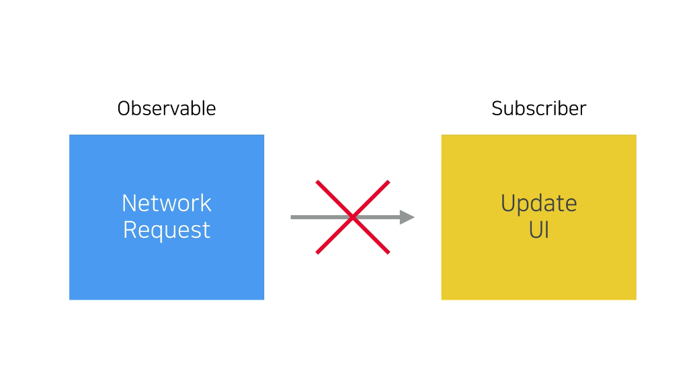
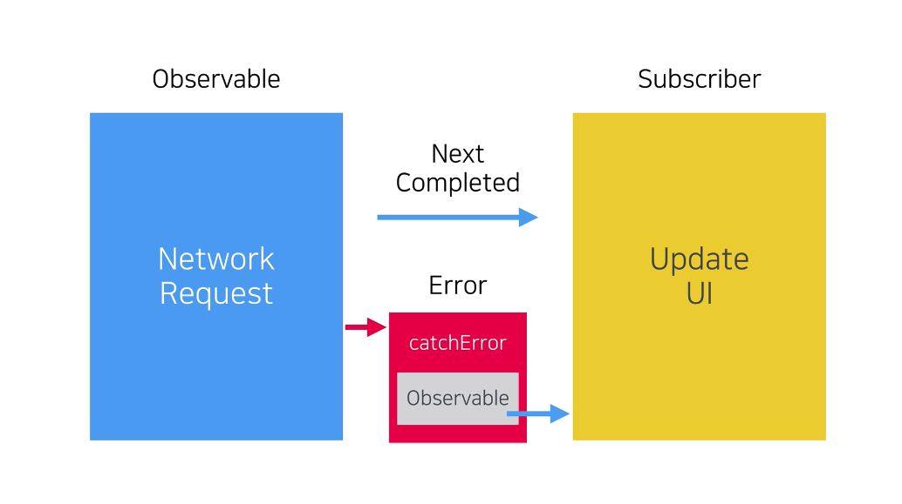
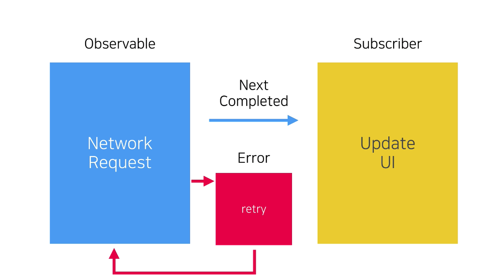

# 13. Error Handling

# 에러 처리 방법

Observable에서 전달한 error 이벤트가 구독자에게 전달되면 구독이 종료되고 더 이상 새로운 이벤트가 전달되지 않음  
즉, 더 이상 새로운 이벤트를 처리할 수 없게 됨



- 예를 들어 Observable이 network 요청을 처리하고 구독자가 UI를 업데이트하는 패턴을 생각해보자
- 보통 UI를 업데이트하는 코드는 next 이벤트가 전달되는 시점에 실행됨
- error 이벤트가 전달되면 구독이 종료되고 더 이상 next 이벤트가 전달되지 않음
- 그래서 UI를 업데이트하는 코드는 실행되지 않음

### RxSwift는 2가지 방법으로 이런 문제를 해결함



- 첫 번째 방법은 `error 이벤트가 전달되면 새로운 Observable을 리턴`하는 것 → `catchError 연산자`를 사용함
    - Observable이 전달하는 next 이벤트와 completed 이벤트는 그대로 구독자에게 전달됨
    - 반면 error 이벤트가 전달되면 새로운 Observable을 구독자에게 전달함
- 다시 network 요청을 생각해보면 기본값이나 로컬 캐시를 방출하는 Observable을 구독자에게 전달할 수 있음
- 그래서 error가 발생한 경우에도 UI는 적절한 값으로 업데이트 됨

<br/>



- 두 번째 방법은 `error가 발생한 경우 Observable을 다시 구독`하는 것 → `retry 연산자`를 사용함
- error가 발생하지 않을 때까지 무한정 재시도하거나 재시도 횟수를 제한할 수 있음

# catchError


- catchError 연산자는 next 이벤트와 completed 이벤트는 구독자에게 그대로 전달함
- 반면 `error 이벤트는 전달하지 않고 새로운 Observable이나 기본값을 전달함`
- 이 연산자는 다양한 상황에서 사용되지만 특히 네트워크 요청을 구현할 때 많이 사용함
- 올바른 응답을 받지 못한 상황에서 로컬 캐시를 사용하거나 기본 값을 사용하도록 구현할 수 있음

<br/>

```swift
let subject = PublishSubject<Int>()
let recovery = PublishSubject<Int>()

subject
   .subscribe { print($0) }
   .disposed(by: bag)

subject.onError(MyError.error)
// 출력 결과
//error(error)
```

- subject로 error 이벤트를 전달하면 구독자에게 그대로 전달됨
- 그리고 구독이 바로 종료되기 때문에 다른 이벤트는 더 이상 전달되지 않음

## catchError 연산자 정의

```swift
func catchError(_ handler: @escaping (Error) throws -> RxSwift.Observable<Self.Element>) -> RxSwift.Observable<Self.Element>
```

- 이 연산자는 클로저를 파라미터로 받음
- error 이번트는 클로저 파라미터로 전달되고 클로저는 새로운 Observable을 리턴함
- 그리고 Observable이 방출하는 요소의 형식은 소스 Observable과 동일함
- catchError 연산자는 `소스 Observable에서 error 이벤트가 전달되면 소스 Observable을 클로저가 리턴하는 Observable로 교체함`
- 소스 Observable은 더 이상 다른 이벤트를 전달하지 못 하지만 교체된 Observable은 문제가 없기 때문에 계속해서 다른 이벤트를 전달함

<br/>

catchError 추가

```swift
let subject = PublishSubject<Int>()
let recovery = PublishSubject<Int>()

subject
    .catchError { _ in recovery }
    .subscribe { print($0) }
    .disposed(by: bag)

subject.onError(MyError.error)
// 출력 결과 없음
```

- 구독자에게 error 이벤트가 전달되지 않음
- catchError 연산자가 recovery subject로 교체했기 때문

<br/>

```swift
subject.onError(MyError.error)

subject.onNext(11)
// 출력 결과 없음
```

- 이렇게 subject는 더 이상 다른 이벤트를 전달하지 못 함

<br/>

```swift
subject.onError(MyError.error)
subject.onNext(11)

recovery.onNext(22)
// 출력 결과
//next(22)
```

- recovery subject는 새로운 요소를 방출할 수 있음

<br/>

```swift
subject.onError(MyError.error)
subject.onNext(11)

recovery.onNext(22)

recovery.onCompleted()
// 출력 결과
//next(22)
//completed
```

- completed 이벤트를 전달하면 구독이 error 없이 정상적으로 종료됨
- catchError 연산자는 소스 Observable에서 발생한 error를 새로운 Observable로 교체하는 방식으로 처리함

# catchErrorJustReturn

Observable 대신 기본값을 리턴하는 연산자

```swift
func catchErrorJustReturn(_ element: Self.Element) -> RxSwift.Observable<Self.Element>
```

- 연산자의 이름이 모든 걸 설명함
- `소스 Observable에서 에러가 발생하면 파라미터로 전달한 기본값을 구독자에게 전달함`
- `파라미터의 형식은 항상 소스 Observable이 방출하는 요소의 형식과 같음`


- catchErrorJustReturn 연산자의 파라미터 형식이 Int로 되어있는데 이것은 Subject가 방출하는 요소의 형식이 Int로 선언되어 있기 때문

<br/>

```swift
let subject = PublishSubject<Int>()

subject
    .catchErrorJustReturn(-1)
    .subscribe { print($0) }
    .disposed(by: bag)

subject.onError(MyError.error)
// 출력 결과
//next(-1)
//completed
```

- 코드를 실행하면 subject로 error 이벤트가 전달되고 catchErrorJustReturn 연산자의 파라미터로 전달한 값이 구독자에게 전달됨
- 소스 Observable은 더 이상 다른 이벤트를 전달할 수 없고 `파라미터로 전달한 것은 Observable이 아니라 하나의 값임`
- `더 이상 전달될 이벤트가 없기 때문에 바로 completed 이벤트가 전달되고 구독이 종료됨`

### 정리

- error가 발생했을 때 사용할 수 있는 `기본값`이 있다면 `catchErrorJustReturn` 연산자를 사용함
- 하지만 발생한 error 종류와 관계 없이 항상 동일한 값이 리턴된다는 단점이 있음
- 나머지 경우에는 `catchError` 연산자를 사용함
- `클로저를 통해 error 처리 코드를 자유롭게 구현`할 수 있다는 장점이 있음
- 두 연산자와 달리 `작업을 처음부터 다시 시작하고 싶다면 retry 연산자를 사용`

# retry


- Observable에서 `error가 발생하면 Observable에 대한 구독을 해제하고 새로운 구독을 시작함`
- 새로운 구독이 시작되기 때문에 Observable Sequence는 처음부터 다시 시작됨
- Observable에서 error가 발생하지 않는다면 정상적으로 종료되고 error가 발생하면 또 다시 새로운 구독을 시작함

<br/>

```swift
var attempts = 1

let source = Observable<Int>.create { observer in
    let currentAttempts = attempts
    // Sequence의 시작을 확인하는 로그
    print("#\(currentAttempts) START")

    // attempts 변수에 저장된 값이 3보다 작다면 error 이벤트를 방출하고 변수를 1씩 증가시킴
    if attempts < 3 {
      observer.onError(MyError.error)
      attempts += 1
    }

    observer.onNext(1)
    observer.onNext(2)
    observer.onCompleted()
         
    return Disposables.create {
        // Sequence의 끝을 확인하는 로그
        print("#\(currentAttempts) END")
    }
}

source
   .subscribe { print($0) }
   .disposed(by: bag)
// 출력 결과
//#1 START
//error(error)
//#1 END
```

- 첫 번째 실행에서 error 이벤트가 바로 전달되고 구독이 종료됨

## retry 연산자 추가

retry 연산자는 2가지 형태가 있음

```swift
public func retry() -> RxSwift.Observable<Self.Element>
```

- `파라미터 없이 호출하면 Observable이 정상적으로 완료될 때까지 계속해서 재시도함`
- 만약 Observable에서 반복적으로 error가 발생하면 재시도 횟수가 늘어나고 그만큼 리소스가 낭비됨
- 심한 경우에는 `무한 루프`처럼 터치 이벤트를 처리할 수 없거나 앱이 강제로 종료되는 문제가 발생함
- 그래서 `파라미터 없이 호출하는 것은 가능하다면 피해야됨`

<br/>

```swift
// If you encounter an error and want it to retry once, then you must use `retry(2)`
public func retry(_ maxAttemptCount: Int) -> RxSwift.Observable<Self.Element>
```

- 이 형태의 연산자는 `최대 재시도 횟수를 파라미터로 받음`
- 그래서 위에서 언급된 문제는 발생하지 않음
- 재시도 횟수를 파라미터로 전달할 때는 주석에 있는 설명처럼 항상 `1을 더해서 전달해야 됨`

<br/>

```swift
var attempts = 1

let source = Observable<Int>.create { observer in
    let currentAttempts = attempts
    print("#\(currentAttempts) START")

    if attempts < 3 {
      observer.onError(MyError.error)
      attempts += 1
    }

    observer.onNext(1)
    observer.onNext(2)
    observer.onCompleted()
         
    return Disposables.create {
        print("#\(currentAttempts) END")
    }
}

source
    .retry()
    .subscribe { print($0) }
    .disposed(by: bag)
// 출력 결과
//#1 START
//#1 END
//#2 START
//#2 END
//#3 START
//next(1)
//next(2)
//completed
//#3 END
```

- 처음 두 번의 시도는 실패하고 세 번째 시도에서 성공함
- 이런 결과가 나온 이유는 if 조건절에서 attempts 변수의 값이 3보다 작은 경우에만 error 이벤트를 전달하기 때문

<br/>

if 조건문 수정

```swift
var attempts = 1

let source = Observable<Int>.create { observer in
    let currentAttempts = attempts
    print("#\(currentAttempts) START")

    if attempts > 0 {
      observer.onError(MyError.error)
      attempts += 1
    }

    observer.onNext(1)
    observer.onNext(2)
    observer.onCompleted()
         
    return Disposables.create {
        print("#\(currentAttempts) END")
    }
}

source
    .retry()
    .subscribe { print($0) }
    .disposed(by: bag)
// 출력 결과
//#1 START
//#1 END
//#2 START
//#2 END
//#3 START
//#3 END
//#4 START
//#4 END
//#5 START
//#5 END
//#6 START
//#6 END
//#7 START
//#7 END
//#8 START
//#8 END
//#9 START
//#9 END
//#10 START
//#10 END
// ...
```

- 계속해서 error 이벤트만 전달되고 마치 무한루프처럼 계속 재시도함
- 이렇게 하면 여러 가지 문제가 발생하기 때문에 `최대 재시도 횟수를 지정하는 방식으로 구현해야 함`

<br/>

retry 연산자의 파라미터로 7을 전달

```swift
var attempts = 1

let source = Observable<Int>.create { observer in
    let currentAttempts = attempts
    print("#\(currentAttempts) START")

    if attempts > 0 {
      observer.onError(MyError.error)
      attempts += 1
    }

    observer.onNext(1)
    observer.onNext(2)
    observer.onCompleted()
         
    return Disposables.create {
        print("#\(currentAttempts) END")
    }
}

source
    .retry(7)
    .subscribe { print($0) }
    .disposed(by: bag)
// 출력 결과
//#1 START
//#1 END
//#2 START
//#2 END
//#3 START
//#3 END
//#4 START
//#4 END
//#5 START
//#5 END
//#6 START
//#6 END
//#7 START
//#7 END
//error(error)
```

- Observable에서 구현한 코드가 모두 7번 실행됨
- `마지막 결과 역시 실패라면 구독자에게 error 이벤트가 전달되고 구독이 종료됨`
- 그렇다면 여기서 재시도 횟수는 7번인가?
    - 첫 번째 실행(#1)은 재시도가 아님
    - 첫 번째 실행에서 error 이벤트가 전달되면 다시 처음부터 실행하게 되는데 #2부터 첫 번째 재시도임
    - 그래서 실제로 재시도한 횟수는 7번이 아니라 6번임
    - `최대 재시도 횟수를 전달할 때는 항상 1을 더해야 됨` → 우리가 원하는 횟수만큼 재시도함

<br/>

if 조건문을 원래대로 수정

```swift
var attempts = 1

let source = Observable<Int>.create { observer in
    let currentAttempts = attempts
    print("#\(currentAttempts) START")

    if attempts < 3 {
      observer.onError(MyError.error)
      attempts += 1
    }

    observer.onNext(1)
    observer.onNext(2)
    observer.onCompleted()
         
    return Disposables.create {
        print("#\(currentAttempts) END")
    }
}

source
    .retry(7)
    .subscribe { print($0) }
    .disposed(by: bag)
// 출력 결과
//#1 START
//#1 END
//#2 START
//#2 END
//#3 START
//next(1)
//next(2)
//completed
//#3 END
```

- 두 번째 재시도에서 next 이벤트와 completed 이벤트가 전달됨
- `최대 재시도 횟수 이내에 작업이 정상적으로 완료되면 더 이상 재시도하지 않고 종료함`
- retry 연산자는 `error가 발생한 즉시 재시도하기 때문에 우리가 재시도 시점을 제어하는 것은 불가능`
- 네트워크 요청에서 error가 발생했다면 정상적인 응답을 받거나 최대 횟수에 도달할 때까지 계속해서 재시도함
- 만약 사용자가 재시도 버튼을 탭하는 시점에만 재시도 하도록 구현하고 싶다면 어떻게 해야 할까? → `retryWhen 연산자` 사용

# retryWhen

```swift
public func retryWhen<TriggerObservable: ObservableType, Error: Swift.Error>(_ notificationHandler: @escaping (Observable<Error>) -> TriggerObservable)
    -> Observable<Element> {
    return RetryWhenSequence(sources: InfiniteSequence(repeatedValue: self.asObservable()), notificationHandler: notificationHandler)
}
```

- 이 연산자는 클로저를 파라미터로 받음
- `클로저의 파라미터에는 발생한 error를 방출하는 Observable이 전달됨`
- 클로저는 `TriggerObservable`을 리턴함
- `TriggerObservable이 next 이벤트를 전달하는 시점에 소스 Observable에서 새로운 구독을 시작함` (다시 말해서 작업을 재시도함)

```swift
var attempts = 1

let source = Observable<Int>.create { observer in
   let currentAttempts = attempts
   print("START #\(currentAttempts)")
   
   if attempts < 3 {
      observer.onError(MyError.error)
      attempts += 1
   }
   
   observer.onNext(1)
   observer.onNext(2)
   observer.onCompleted()
   
   return Disposables.create {
      print("END #\(currentAttempts)")
   }
}

let trigger = PublishSubject<Void>()

source
    .retryWhen { _ in trigger }
    .subscribe { print($0) }
    .disposed(by: bag)
// 출력 결과
//START #1
//END #1
```

- if 조건문 때문에 첫 번째 실행에서 error가 발생
- 하지만 retry 연산자와 달리 `바로 재시도하지 않고 TriggerObservable이 next 이벤트를 전달할 때까지 대기함`

<br/>

```swift
source
    .retryWhen { _ in trigger }
    .subscribe { print($0) }
    .disposed(by: bag)

trigger.onNext(())
// 출력 결과
//START #1
//END #1
//START #2
//END #2
```

- `trigger subject로 next 이벤트를 전달하면 소스 Observable에서 새로운 구독이 시작됨`
- 이번에도 소스 Observable에서 error 이벤트가 전달되기 때문에 다시 대기함

<br/>

```swift
trigger.onNext(())
trigger.onNext(())
// 출력 결과
//START #1
//END #1
//START #2
//END #2
//START #3
//next(1)
//next(2)
//completed
//END #3
```

- 두 번째 재시도에서는 error가 발생하지 않음
- 이 때는 next 이벤트와 completed 이벤트가 정상적으로 전달되고 구독이 종료됨
