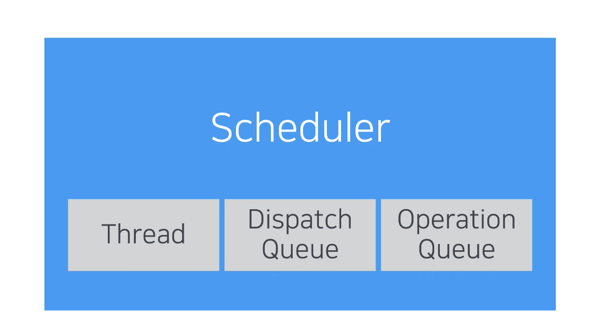

# 12. Scheduler


iOS 앱을 만들다가 `쓰레드 처리`가 필요하면 `GCD`를 사용함  
RxSwift에서는 `Scheduler`를 사용함



Scheduler는 `특정 코드가 실행되는 context를 추상화한 것임`  
context는 `low level thread`가 될 수도 있고 `DispatchQueue`나 `OperationQueue`가 될 수도 있음


Scheduler는 추상화된 context이기 때문에 `쓰레드와 1대1로 매칭되지 않음`  
하나의 쓰레드에 2개 이상의 개별 Scheduler가 존재하거나 하나의 Scheduler가 2개의 쓰레드에 걸쳐있는 경우도 있음  
큰 틀에서 보면 GCD와 유사하고 몇 가지 규칙에 따라서 Scheduler를 사용하면 됨


예를 들어 UI를 업데이트하는 코드는 메인 쓰레드에서 실행해야 됨  
GCD에서는 `Main Queue`에서 실행하고 RxSwift에서는 `Main Scheduler`에서 실행함  
Network 요청이나 파일 처리 같은 작업을 메인 쓰레드에서 실행하면 `블로킹`이 발생함  
그래서 GCD에서는 `Global Queue`에서 작업을 실행하고 RxSwift에서는 `Background Scheduler`를 사용함


- RxSwift는 GCD와 마찬가지로 다양한 기본 Scheduler를 제공함
- 내부적으로 GCD와 유사한 방식으로 동작하고 실행할 작업을 스케줄링함
- 스케줄링 방식에 따라서 `Serial Scheduler`와 `Concurrent Scheduler`로 구분함
- 가장 기본적인 Scheduler는 `CurrentThreadScheduler` → Scheduler를 별도로 지정하지 않는다면 이 스케줄러가 사용됨
- `메인 쓰레드`와 연관된 스케줄러는 `MainScheulder` → Main Queue처럼 UI를 업데이트할 때 사용함
- 작업을 실행할 DispatchQueue를 직접 지정하고 싶다면 `SerialDispatchQueueScheduler`와 `ConcurrentDispatchQueueScheduler`를 사용함
- 앞에서 설명한 MainScheduler는 SerialDispatchQueueScheduler의 일종임
- 백그라운드 작업을 실행할 때는 `SerialDispatchQueueScheduler`와 `ConcurrentDispatchQueueScheduler`를 사용함
- 실행 순서를 제외하거나 동시에 실행 가능한 작업 수를 제한하고 싶다면 `OperationQueueScheduler`를 사용함 → 이 스케줄러는 DispatchQueue가 아닌 `OperationQueue`를 사용해서 생성함
- 이 외에도 Unit Test에 사용하는 `TestScheduler`가 제공됨
- Scheduler를 직접 구현하는 것도 가능 → `Custom Scheduler`

### Scheduler를 올바르게 사용하기 위해서는 2가지를 확실히 공부해야됨

- 첫 번째는 `Observable이 생성되는 시점을 이해하는 것`
- 두 번째는 `Scheduler를 지정하는 방법`

<br/>

1에서 9까지 방출하는 Observable이 선언되어 있음  
filter 연산자로 짝수를 필터링하고 map 연산자로 개별 결과에 2를 곱하고 있음  
연산자가 어느 쓰레드에서 실행되는지 확인하는 로그도 추가되어 있음

```swift
Observable.of(1, 2, 3, 4, 5, 6, 7, 8, 9)
   .filter { num -> Bool in
      print(Thread.isMainThread ? "Main Thread" : "Background Thread", ">> filter")
      return num.isMultiple(of: 2)
   }
   .map { num -> Int in
      print(Thread.isMainThread ? "Main Thread" : "Background Thread", ">> map")
      return num * 2
   }
// 출력 결과 없음
```

- Observable이 생성되는 것도 아니고 연산자가 호출된 것도 아님
- 위 코드는 Observable이 어떤 요소를 방출하고 어떻게 처리해야 하는지를 나타낼 뿐임
- Observable이 생성되고 연산자가 호출되는 시점은 바로 `구독이 시작되는 시점`

<br/>

구독 추가

```swift
Observable.of(1, 2, 3, 4, 5, 6, 7, 8, 9)
    .filter { num -> Bool in
      print(Thread.isMainThread ? "Main Thread" : "Background Thread", ">> filter")
      return num.isMultiple(of: 2)
    }
    .map { num -> Int in
      print(Thread.isMainThread ? "Main Thread" : "Background Thread", ">> map")
      return num * 2
    }
    .subscribe {
        print(Thread.isMainThread ? "Main Thread" : "Background Thread", ">> subscribe")
        print($0)
    }
    .disposed(by: bag)
// 출력 결과
//Main Thread >> filter
//Main Thread >> filter
//Main Thread >> map
//Main Thread >> subscribe
//next(4)
//Main Thread >> filter
//Main Thread >> filter
//Main Thread >> map
//Main Thread >> subscribe
//next(8)
//Main Thread >> filter
//Main Thread >> filter
//Main Thread >> map
//Main Thread >> subscribe
//next(12)
//Main Thread >> filter
//Main Thread >> filter
//Main Thread >> map
//Main Thread >> subscribe
//next(16)
//Main Thread >> filter
//Main Thread >> subscribe
//completed
```

- 이렇게 해야 Observable이 생성되고 연산자를 거쳐서 최종 결과가 구독자에게 전달됨  
→ `Observable이 생성되는 시점` 이해하기

<br/>

기존 코드에서는 Scheduler를 지정하는 코드가 없음  
→ 이 경우에는 기본 Scheduler인 `CurrentThreadScheduler`가 사용됨

playground가 실행되는 쓰레드는 메인 쓰레드이고 여기에서 작성한 모든 코드는 메인 쓰레드에서 실행됨  
→ 그래서 기존 코드의 결과 로그를 보면 모두 Main Thread가 써져있음

map 연산자를 메인 쓰레드가 아니라 백그라운드 쓰레드에서 실행하고 싶다면?  
→ RxSwift에서 Scheduler를 지정할 때는 `observeOn(_:)`과 `subscribeOn(_:)`을 사용함  
→ `observeOn 메소드는 연산자를 실행할 Scheduler를 지정함`

```swift
let backgroundScheduler = ConcurrentDispatchQueueScheduler(queue: DispatchQueue.global())

Observable.of(1, 2, 3, 4, 5, 6, 7, 8, 9)
    .filter { num -> Bool in
      print(Thread.isMainThread ? "Main Thread" : "Background Thread", ">> filter")
      return num.isMultiple(of: 2)
    }
    // observeOn 메소드를 사용해서 map 연산자를 실행할 Scheduler를 backgroundScheduler로 지정
    .observeOn(backgroundScheduler)
    .map { num -> Int in
      print(Thread.isMainThread ? "Main Thread" : "Background Thread", ">> map")
      return num * 2
    }
    .subscribe {
        print(Thread.isMainThread ? "Main Thread" : "Background Thread", ">> subscribe")
        print($0)
    }
    .disposed(by: bag)
// 출력 결과
//Main Thread >> filter
//Main Thread >> filter
//Main Thread >> filter
//Background Thread >> map
//Main Thread >> filter
//Main Thread >> filter
//Main Thread >> filter
//Main Thread >> filter
//Background Thread >> subscribe
//next(4)
//Main Thread >> filter
//Background Thread >> map
//Main Thread >> filter
//Background Thread >> subscribe
//next(8)
//Background Thread >> map
//Background Thread >> subscribe
//next(12)
//Background Thread >> map
//Background Thread >> subscribe
//next(16)
//Background Thread >> subscribe
//completed
```

- 결과는 보면 map 연산자가 백그라운드에서 실행됨
- observeOn 메소드는 `이어지는 연산자들이 작업을 실행할 Scheduler를 지정함`
- 그래서 뒤에 있는 map은 backgroundScheduler에서 실행되지만 앞에 있는 filter에는 영향을 주지 않음
- subscribe에 있는 코드는 background에서 실행됨
- observeOn 메소드로 지정한 Scheduler는 다른 Scheduler로 변경하기 전까지 계속 사용됨

 <br/>

subscribeOn 메소드는 `구독을 시작하고 종료할 때 사용할 Scheduler를 지정함`  
구독을 시작하면 Observable에서 새로운 이벤트가 방출됨  
`이벤트를 방출할 Scheduler를 지정`하는 것임  
그리고 create 연산자로 구현한 코드 역시 이 메소드로 지정한 Scheduler에서 실햄됨  
이 매소드를 사용하지 않는다면 subscribe 메소드가 호출된 Scheduler에서 새로운 Sequence가 시작됨

```swift
let backgroundScheduler = ConcurrentDispatchQueueScheduler(queue: DispatchQueue.global())

Observable.of(1, 2, 3, 4, 5, 6, 7, 8, 9)
    .filter { num -> Bool in
      print(Thread.isMainThread ? "Main Thread" : "Background Thread", ">> filter")
      return num.isMultiple(of: 2)
    }
    .observeOn(backgroundScheduler)
    .map { num -> Int in
      print(Thread.isMainThread ? "Main Thread" : "Background Thread", ">> map")
      return num * 2
    }
    // subscribeOn 메소드를 호출하고 MainScheduler를 전달
    // MainScheduler는 instance 속성으로 쉽게 얻을 수 있음
    .subscribeOn(MainScheduler.instance)
    .subscribe {
        print(Thread.isMainThread ? "Main Thread" : "Background Thread", ">> subscribe")
        print($0)
    }
    .disposed(by: bag)
// 출력 결과
//Main Thread >> filter
//Main Thread >> filter
//Main Thread >> filter
//Background Thread >> map
//Main Thread >> filter
//Main Thread >> filter
//Main Thread >> filter
//Background Thread >> subscribe
//Main Thread >> filter
//next(4)
//Main Thread >> filter
//Background Thread >> map
//Main Thread >> filter
//Background Thread >> subscribe
//next(8)
//Background Thread >> map
//Background Thread >> subscribe
//next(12)
//Background Thread >> map
//Background Thread >> subscribe
//next(16)
//Background Thread >> subscribe
//completed
```

- subscribe에서 실행되는 코드는 여전히 백그라운드에서 실행되고 있음
- 메소드 이름 때문에 많이 혼동하게 되는데 `subscribeOn 메소드는 subscribe 메소드가 호출되는 Scheduler를 지정하는 것이 아님`
- 그리고 이어지는 연산자가 호출되는 Scheduler를 지정하는 것도 아님
- `Observable이 시작되는 시점에 어떤 Scheduler를 사용할지 지정하는 것임`
- 이 차이를 확실하게 구분해야 됨
- 그리고 observeOn 메소드와 달리 `호출 시점이 중요하지 않음`
- subscribeOn 메소드의 위치가 바뀐 아래 코드도 출력 결과는 같음

```swift
Observable.of(1, 2, 3, 4, 5, 6, 7, 8, 9)
    .subscribeOn(MainScheduler.instance)
    .filter { num -> Bool in
      print(Thread.isMainThread ? "Main Thread" : "Background Thread", ">> filter")
      return num.isMultiple(of: 2)
    }
    .observeOn(backgroundScheduler)
    .map { num -> Int in
      print(Thread.isMainThread ? "Main Thread" : "Background Thread", ">> map")
      return num * 2
    }
    .subscribe {
        print(Thread.isMainThread ? "Main Thread" : "Background Thread", ">> subscribe")
        print($0)
    }
    .disposed(by: bag)
```

<br/>

subscribe 메소드를 MainScheduler에서 호출하고 싶다면?

```swift
let backgroundScheduler = ConcurrentDispatchQueueScheduler(queue: DispatchQueue.global())

Observable.of(1, 2, 3, 4, 5, 6, 7, 8, 9)
    .subscribeOn(MainScheduler.instance)
    .filter { num -> Bool in
      print(Thread.isMainThread ? "Main Thread" : "Background Thread", ">> filter")
      return num.isMultiple(of: 2)
    }
    .observeOn(backgroundScheduler)
    .map { num -> Int in
      print(Thread.isMainThread ? "Main Thread" : "Background Thread", ">> map")
      return num * 2
    }
    .observeOn(MainScheduler.instance)
    .subscribe {
        print(Thread.isMainThread ? "Main Thread" : "Background Thread", ">> subscribe")
        print($0)
    }
    .disposed(by: bag)
// 출력 결과
//Main Thread >> filter
//Main Thread >> filter
//Main Thread >> filter
//Background Thread >> map
//Main Thread >> filter
//Main Thread >> filter
//Main Thread >> filter
//Main Thread >> filter
//Main Thread >> filter
//Main Thread >> filter
//Background Thread >> map
//Background Thread >> map
//Background Thread >> map
//Main Thread >> subscribe
//next(4)
//Main Thread >> subscribe
//next(8)
//Main Thread >> subscribe
//next(12)
//Main Thread >> subscribe
//next(16)
//Main Thread >> subscribe
//completed
```

- subscribe 호출하기 전에 observeOn 메소드를 호출하고 MainScheduler를 전달함
- 결과를 보면 subscribe 메소드가 MainScheduler에서 실행됨

## 정리

- subscribeOn 메소드는 `Observable이 시작되는 Scheduler를 지정함`
- observeOn 메소드는 `이어지는 연산자가 실행되는 Scheduler를 지정함`
